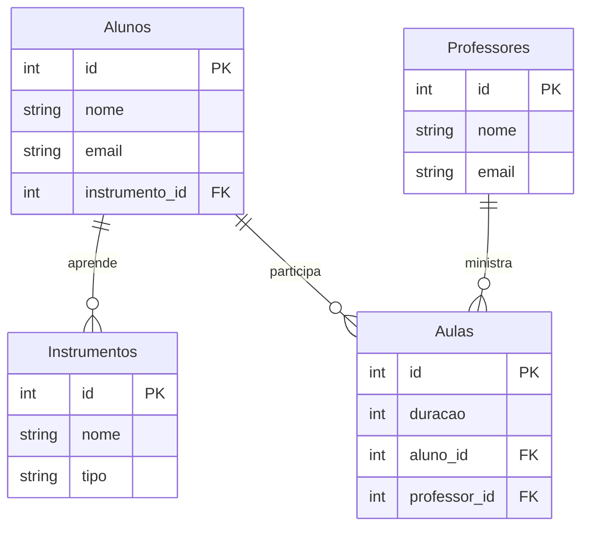

# exx-modelagem

```mermaid
erDiagram
    Alunos {
        int id PK
        string nome
        string email
        int instrumento_id FK
    }
    Instrumentos {
        int id PK
        string nome
        string tipo
    }
    Professores {
        int id PK
        string nome
        string email
    }
    Aulas {
        int id PK
        int duracao
        int aluno_id FK
        int professor_id FK
    }

    Alunos ||--o{ Instrumentos : "aprende"
    Professores ||--o{ Aulas : "ministra"
    Alunos ||--o{ Aulas : "participa"
```
